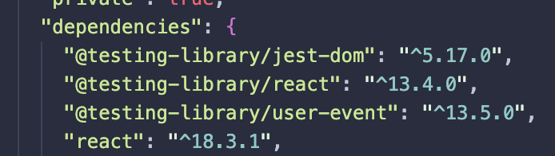

# `` React Testing Library ``
# `` Testing In React ``

[text](https://testing-library.com/docs/react-testing-library/intro/)

- In the Package.json file when a new react app is created using CRA
- ;
- These testing packages are installed by default including the jest-dom
- ``` jest-dom ``` allows us to manipulate the elements from the DOM tree inside of jest test runner
- ```@testing-library/react``` Allow us to write tests onto react components 
- ```@testing-library/user-event``` Allows us to test user events like hover click etc...
