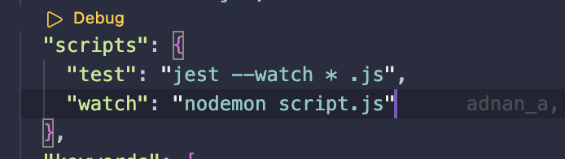

# ```Testing Using Jest```

`` Tests can be Grouped into 3 categories ``

```
1. Unit Testing
2. Integration Testing
3. Automation Testing
```

Unit Testing -> 
Basically translates to testing on a single component, function etc...

Integration Testing ->
Testing how different pieces of code work together 

Automation Testing -> 
Testing real life scenarios, interacting with the Ui and performing real actions.

* Implementation Cost increases as we go down the categories *
  
## `` Unit Tests ``

* The one thing to keep in mind is that unit tests don't test the contract.
* What does that mean?
* The contract is the connection between things.
* It could be a contract between a server and a database, It could  be a contract between a function and another function.
* Unit tests would test the sign and function and a load function, but not the contract between them,
whether they integrate well together

## `` Integration Tests ``

- Integration tests are all about cross communication between different units of code.
- Think of integration tests as a connections to see how they work together instead of individual small units that unit tests test.
  
- There's more deaf time involved in thinking them out and writing them compared to unit tests which are much faster to run.
  
## `` Automation Tests ``

- End-End testing. 
- Automation tests are UI tests that are always running in the browser

## ``` Extras ```

- In the Package.js file running npm jest runs the test files ```.test.js ``` in the directory.
- ;
- In order to run the test live rather than executing the same command ``` npm test ```
- we can modify the npm test command to continuously watch files for changes and test